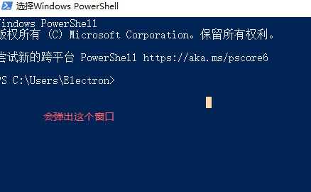
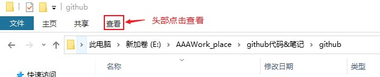
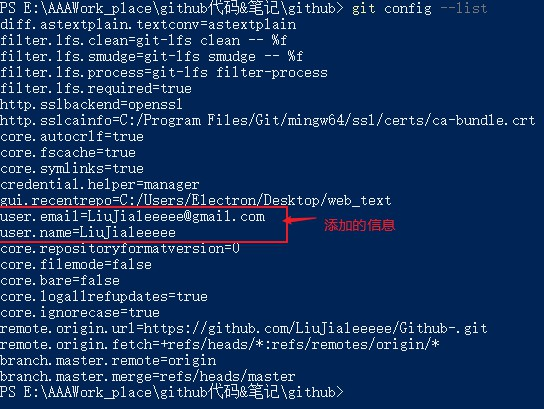
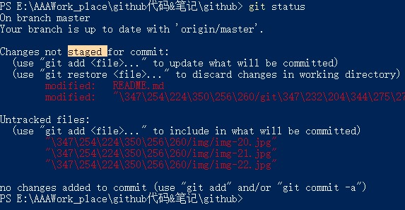

# git的使用
## 1. 简介
github 的使用离不开 git, 所以我们要先了解 git 的使用,才可以去很好的使用github.
## 2. Git 的作用
### 2.1 Git 是什么?
Git 是一个**版本**控制管理系统, 它可以保存文档的状态, 并且作为记录保存起来.以此可以在任何时间将更新记录恢复到记录的时间点.
### 2.2 为什么要 Git
项目太大时, 人为维护很麻烦
		还会产生覆盖问题
		而 git 在出现问题时会报错, 给我们一个提示

### 2.3 版本管理
1. 版本管理就是每过一段时间保存一次, 以便在之后的时间线可以对版本进行回滚等操作.
2. 每一个点代表一个版本,我们可以在时间线上对我们的代码进行管理

3.  git 的保存也是如此, 以时间为线, 记录了我们的代码(我们保存了的代码)

## 3. Git安装

1. [下载地址](https://git-scm.com/downloads)
    安装的时候我们一路回车就可以.

2. 验证 
    安装后我们需要先进行验证,验证git是否安装
    我的是 win10 64位系统, 我就以 win10 举例
    我们在验证的时候需要使用 powershell

  **powershell**

  其是 win10 系统的命令行操作系统, 进入方式有两种:

  * 第一种是 win + R, 在弹出的窗口输入powershell
    

  * 第二种方式是: 找个文件夹 shift + 右键, 之后选择 *在此处打开powershell窗口* 选项卡同样可以进入powershell.但是这种方法打开的 powershell 的位置是我们右键文件夹当前的位置, 也就是说,我们不用在powershell 里用命令行的形式去切换当前文件位置了.我们可以直接找到那个文件, 右键打开powershell

  打开powershell 后我们就可以检查 git 的安装情况了

  我们在 powershell 中输入: git --version(这个命令的意思是查询 git 的版本)

  如果显示 git 的版本号,则证明 git 安装成功

  

## 4. Git 的流程介绍

### 4.1 Git 的作用

Git 是一个仓库, 它保存了我们的代码, 我们可以通过它保存我们代码的历史记录. 同时它最大的作用是让我们进行多人合作, 不至于在编写代码时产生混乱.

### 4.2 Git 的保存等简要流程

话不多说, 先上图

纯手画, 轻喷

首先我们要注意到本地文件, 这是我们在自己的电脑上编写代码的文件位置.

假如说, 我们现在写完了一个文件, 那么我们怎么使用 git 呢?

1. 初始化

   首先, 打开想要保存到 git 仓库的那个文件 使用 shift + 右键 找到 powershell 呼唤出来

   此时, 这个文件里没有仓库, 我们要建立一个仓库

   在命令行中输入 git init

   命令行中对 git 仓库的所有命令都是以 git 开头(命令行程序的特点,)

   init 英文就是初始化的意思, 通过这句话我们就在这里建立了一个 git 的仓库了

   但是什么都看不到, 因为它是个隐藏文件, 我们需要显示隐藏文件

   显示隐藏文件的步骤: 

   

   

   这样就显示了隐藏文件

   回到刚才的文件查看是否有.git 文件, 如果有的话则证明创建仓库成功

   

2. 让文件被 git 管理

   配置:

   我们在当前文件夹的所有文件并不是自动被 git 管理的, 我们需要先把文件加入暂存区(图上红色区域)

   **但是**在向 git 仓库提交代码前, 我们需要先对 Git 进行配置

   告诉 git 我们的身份, 在提交的时候需要用到

   * 配置提交人姓名：`git config --global user.name 提交人姓名`

     在命令行中输入以上命令, 在提交的时候会附带提交人姓名, 万一写bug 好找到你

   * 配置提交人姓名：`git config --global user.email 提交人邮箱` 

     随便写也没事

   * 查看git配置信息：`git config --list`

     这里有 git 的配置信息(config就是配置的意思)

     

   查看文件当前文件的 git 情况:

   `git status` 查看文件状态

   使用该命令可以查看当前文件的状态

   是否被 git 接管

   是否有提交的文件

   

   可以看到其中文件有两种状态

   一种是Changes not staged (改变未被提交)

   还有一种是 untracked files (未跟踪的 即未被 git 管理的文件)

   对于 untracked 文件, 我们如果想让该文件被 git 接管则需要在命令行输入

   `git add 文件列表` 追踪文件 这样 该文件便添加到 git 中

