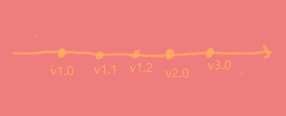

# git的使用
## 1. 简介
github 的使用离不开 git, 所以我们要先了解 git 的使用,才可以去很好的使用github.
## 2. Git 的作用
### 2.1 Git 是什么?
Git 是一个**版本**控制管理系统, 它可以保存文档的状态, 并且作为记录保存起来.它还可以在任何时间将更新记录恢复到记录的时间点.
### 2.2 为什么要 Git
项目太大时, 人为维护很麻烦呗
还会产生覆盖问题
git 在出现问题时会报错
### 2.3 版本管理
1. 版本管理就是每过一段时间保存一次, 以便在之后的时间线可以对版本进行回滚等操作.
2. 每一个点代表一个版本,我们可以在时间线上对我们的代码进行管理

### 2.4 Git安装
[下载地址](https://git-scm.com/downloads)

就是下载就行,一路回车. 
安装后我们需要先进行验证,验证git是否安装 
我的是 win10 64位系统, 我就以 win10 举例
1. powershell工具 
powershell是 win10 系统的命令行操作系统, 进入方式有两种:第一种是 win + R, 在弹出的窗口输入powershell

